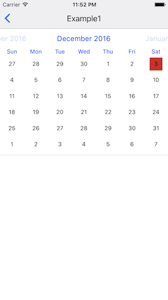
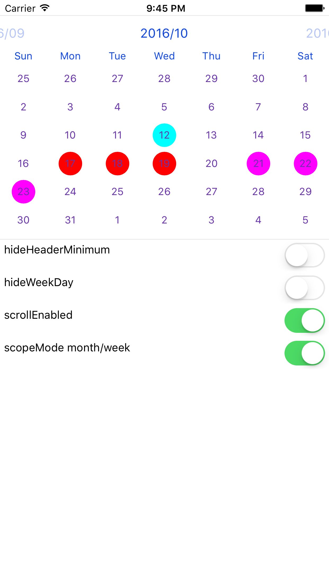

# React-Native-FSCalendar
[FSCalendar](https://github.com/WenchaoD/FSCalendar) bind for ReactNative. It's only work on ios.

## Install

```
npm install react-native-fscalendar
react-native link react-native-fscalendar
```

## Screenshots






## Usage

```
import FSCalendar from 'react-native-fscalendar'

<FSCalendar {...props} />
```

| Property | Type | Default |
|---------------|----------|--------------|
| width | React.PropTypes.number | SCREEN_WIDTH |
| height | React.PropTypes.number | 280 |
| hideHeader | React.PropTypes.bool | true |
| hideWeekDay | React.PropTypes.bool | false |
| scrollEnabled | React.PropTypes.bool | true |
| today | React.PropTypes.instanceOf(Date) | null |
| dateBounds | React.PropTypes.arrayOf(Date) | |
| scopeMode | React.PropTypes.oneOf(['month', 'week']) | month |
| onSelectDate | React.PropTypes.func | |
| onDeselectDate | React.PropTypes.func | |
| onCurrentPageChange | React.PropTypes.func | |
| headerTitleColor | React.PropTypes.string | |
| weekdayTextColor | React.PropTypes.string | |
| titleDefaultColor | React.PropTypes.string | |
| titleSelectionColor | React.PropTypes.string | |
| subtitleDefaultColor | React.PropTypes.string | |
| subtitleSelectionColor | React.PropTypes.string | |
| titleWeekendColor | React.PropTypes.string | |
| subtitleWeekendColor | React.PropTypes.string | |
| titleTodayColor | React.PropTypes.string | |
| subtitleTodayColor | React.PropTypes.string | |
| titlePlaceholderColor | React.PropTypes.string | |
| subtitlePlaceholderColor | React.PropTypes.string | |
| todayColor | React.PropTypes.string | |
| todaySelectionColor | React.PropTypes.string | |
| eventColor | React.PropTypes.string | |
| eventDefaultColor | React.PropTypes.string | |
| eventSelectionColor | React.PropTypes.string | |
| borderDefaultColor | React.PropTypes.string | |
| borderSelectionColor | React.PropTypes.string | |
| selectionColor | React.PropTypes.string | |
| fillDefaultColorDates | React.PropTypes.object | |
| fillSelectionColorDates | React.PropTypes.object | |
| borderDefaultColorDates | React.PropTypes.object | |
| borderSelectionColorDates | React.PropTypes.object | |
| cellShapeDates | React.PropTypes.objectOf(React.PropTypes.number) | |
| titleDefaultColorDates | React.PropTypes.object | |
| titleSelectionColorDates | React.PropTypes.object | |
| subtitleDefaultColorDates | React.PropTypes.object | |
| subtitleSelectionColorDates | React.PropTypes.object | |
| headerMinimumDissolvedAlpha | React.PropTypes.number | |
| headerDateFormat | React.PropTypes.string | |
